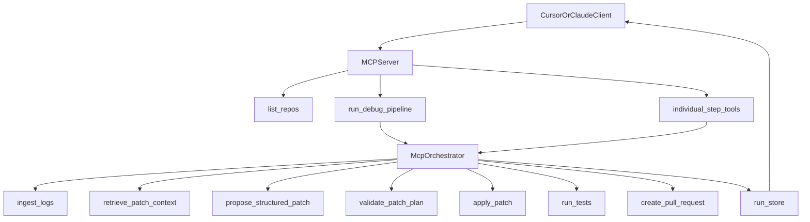

# MCP Hybrid Plan (All-at-Once + Individual Tools)

## Objective

Expose your debugging system as an MCP server that supports:

- one-shot full execution (`run_debug_pipeline`), and
- individually callable steps (`ingest`, `retrieve_context`, `summarize`, `propose`, `validate`, `apply`, `test`, `create_pr`).

This keeps power users flexible while giving most users a safe default single command.

## Phase 1: Stabilize Core Service Layer

Refactor existing stage logic into reusable service functions with clean inputs/outputs (no CLI assumptions).

- Move graph-node logic into service modules and reuse from both graph + MCP handlers:
  - `src/main.py` ingest/cluster/summarize helpers
  - `src/context_retriever.py` context building
  - `src/patch_proposal.py` summary/proposal calls
  - `src/sandbox_apply.py` safe patch application
  - `src/test_runner.py` test execution
  - `src/pr_creator.py` PR creation
- Ensure every service returns structured result envelopes:
  - `status`, `message`, `payload`, `artifacts`, `error`.

## Phase 2: Define MCP Tool Contracts

Create strict request/response schemas for both orchestration and individual steps.

- High-level tool:
  - `run_debug_pipeline(repo_id, options, selected_steps?)`
- Low-level tools:
  - `ingest_logs`
  - `retrieve_patch_context`
  - `summarize_incident`
  - `propose_structured_patch`
  - `validate_patch_plan`
  - `apply_patch`
  - `run_tests`
  - `create_pull_request`
- Add a shared `run_context_id` so users can run a full flow once, then inspect or re-run individual steps against the same context.

## Phase 3: Build MCP Server Entry Point

Add a dedicated MCP server process and register all tools.

- New files:
  - `src/mcp_server.py` (tool registration + transport)
  - `src/mcp_contracts.py` (schemas/types)
  - `src/mcp_orchestrator.py` (step ordering and guardrails)
  - `src/run_store.py` (persist run contexts/results)
- Start with stdio transport for Cursor/Claude integration.
- Provide deterministic tool naming and versioning (`tool_name@v1`) to avoid breaking clients.

## Phase 4: Hybrid Execution Semantics

Support both usage patterns with consistent behavior.

- Full-run tool internally executes ordered steps with dependency enforcement.
- Individual-step tools accept `run_context_id` and validate prerequisites.
- If users call steps out of order, return actionable errors (or optional auto-run prerequisites).
- Keep abstain-first semantics:
  - proposal can abstain,
  - validation can reject,
  - downstream steps become `skipped` with explicit reason.

## Phase 5: Security and Safety Controls

Implement production guardrails before broad rollout.

- Data access:
  - read-only warehouse credentials,
  - redact sensitive values before LLM prompt.
- Repo safety:
  - repo allowlist (`ui-server` first),
  - path allowlist (e.g., app source only),
  - cap files/ops/patch size.
- Write controls:
  - default `apply_to_repo=false`,
  - `create_pr` as draft by default,
  - require explicit flags for write actions.
- Auditability:
  - log each tool call, inputs (redacted), outputs, artifacts, and actor.

## Phase 6: Cursor/Claude Developer Experience

Make tool usage intuitive for colleagues.

- Add clear tool descriptions and example prompts:
  - “Run full exception triage and propose patch for `ui-server` last 60 minutes.”
  - “Re-run only validate/apply/test on run_context_id X.”
- Return concise summaries plus artifact pointers:
  - report path, diff path, PR URL, skipped reasons.
- Include `list_repos` and `list_recent_runs` helper tools for discovery.

## Phase 7: Verification and Rollout

Validate reliability before expanding repositories.

- Test scenarios:
  - full pipeline dry-run,
  - full pipeline with draft PR,
  - each low-level tool independently.
- Track quality metrics:
  - abstain rate,
  - validation reject rate,
  - test pass rate post-apply,
  - PR merge rate.
- Rollout path:
  - week 1-2: internal pilot users in Cursor/Claude,
  - week 3+: broaden and add more safe patch operations.

## Target Architecture

## Immediate First Build (MVP)

1. Implement `mcp_server.py` with `run_debug_pipeline` and 2 low-level tools (`validate_patch_plan`, `run_tests`).
2. Add `run_context_id` persistence.
3. Add `list_repos` (return `ui-server` only).
4. Integrate with Cursor/Claude and validate one end-to-end draft PR flow.
5. Expand remaining low-level tools after API shape stabilizes.

